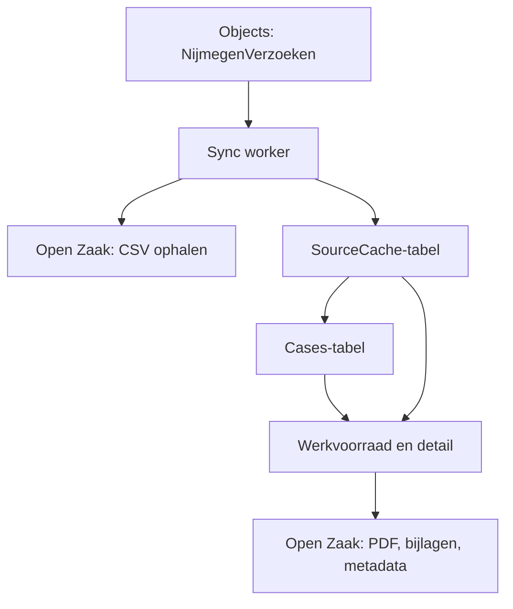
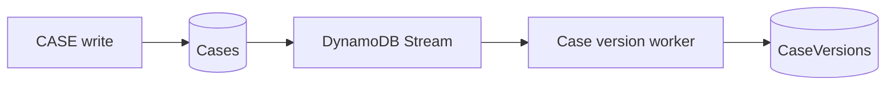

# Woonbehoefte

Tijdelijke verwerkingsomgeving voor de aanvraagronde "Stroomaansluiting woningbouw" (Woonbehoefte). Geen
generiek zaaksysteem: precies genoeg om zo'n 400 aanvragen als werkvoorraad te behandelen, met claim,
beoordeling, status, interne updates en checks.

## Bronnen en data-ownership

- **Objects** (`NijmegenVerzoek`) is de bron voor de ingezonden aanvraagdata (CSV-export per inzending).
- **Open Zaak** blijft de enige bron voor documenten (PDF, bijlagen). De applicatie kopieert nooit een
  bestand naar eigen opslag; een download haalt de inhoud live bij Open Zaak op.
- De applicatie schrijft nooit terug naar Objects, Open Zaak of Open Forms.

Drie volledig gescheiden DynamoDB-tabellen, ook fysiek en via IAM:

Tabel | Inhoud | Removal policy | Wie schrijft
--- | --- | --- | ---
`open-forms-management-woonbehoefte-source-cache` | genormaliseerde CSV-data, refresh-status | `DESTROY` (reproduceerbaar) | sync worker (Get/BatchGet/Put/Update), page Lambda alleen lezen + refresh claimen
`open-forms-management-woonbehoefte-cases` | case, source-links, aantekeningen, activiteit | `RETAIN`, PITR aan | sync worker mag alleen conditioneel *aanmaken* (`GetItem` + `PutItem`, nooit `UpdateItem`/`Query`/`Scan`); page Lambda heeft de volledige menselijke-mutatietoegang
`open-forms-management-woonbehoefte-case-versions` | immutable snapshots van het main CASE-item per versie | `RETAIN`, PITR aan | case-version worker, alleen conditionele `PutItem` (nooit `UpdateItem`/`DeleteItem`); geen enkele andere Lambda heeft hier toegang toe

Een source-refresh kan daardoor nooit lopende menselijke verwerking overschrijven: de sync worker heeft
er via IAM domweg geen rechten toe. Dezelfde scheiding geldt voor de case-versiehistorie: die schrijft de
page Lambda en de sync worker nooit zelf, zie hieronder.

## Refreshflow



Een refresh (`POST /woonbehoefte/refresh`) claimt conditioneel een `runId` en start de sync worker
asynchroon (`InvocationType: Event`). De medewerker ziet voortgang door de werkvoorraad-pagina zelf te
verversen; er is bewust geen live-pollende UI zoals bij Sport, dat hield de bouwtijd korter.

De worker haalt alleen objects op die nog niet als `READY` in de huidige cacheversie staan, parseert de
CSV, en initialiseert daarna voor **elke** actuele `READY`-submission (dus ook al gecachte) een case en
primaire source-link, conditioneel. Zo herstelt een eerder afgebroken run zichzelf bij de volgende
refresh, zonder ooit een bestaande case te overschrijven.

## Case-versiehistorie

Elke succesvolle wijziging van het main CASE-item krijgt een eigen immutable snapshot, downstream via een
DynamoDB Stream op de Cases-tabel. `WoonbehoefteCaseRepository` en de bestaande handlers weten hier niets
van en schrijven nooit rechtstreeks naar de versiehistorie.



De Cases-stream staat op `NEW_AND_OLD_IMAGES`. De worker verwerkt alleen streamrecords met `sk = CASE`;
notes, activities en source-links negeert hij:

- `INSERT` bewaart de NEW-image;
- `MODIFY` bewaart eerst de OLD-image (als die nog ontbreekt) en daarna de NEW-image;
- `REMOVE` bewaart de OLD-image, als die nog ontbreekt.

Een version-item:

```text
PK = CASE#<OF-reference>
SK = VERSION#000000000001
```

met een volledige raw kopie van het main CASE-item onder `snapshot`, inclusief toekomstige CASE-velden.
Geen notes, activities, source-CSV of documenten: die zijn elders al immutable of hebben een andere
ownership.

Een case die al `version 5` was vóór de stream werd aangezet heeft geen historie voor v1-v4: bij de eerste
wijziging erna legt de worker eerst v5 als baseline vast en dan v6. Een case die daarna nooit meer wijzigt
krijgt geen version-rij; de live Cases-tabel met PITR blijft daarvoor de recoverylaag.

Een toekomstige restore herstelt nooit het versienummer van een snapshot. Die kiest een snapshot, leest de
huidige live case, zet de business state van het snapshot terug op de huidige live versie en schrijft dat
als een nieuwe versie (v7 terugzetten op een live v12 wordt v13, niet v7). Er is nu geen restore-UI of
-route: dit is alleen de opslag ervoor.

## Permissions

Resource `woonbehoefte`, acties `view` en `manage`, geen scopes. Zoals overal in deze applicatie:

- `woonbehoefte:view` - lezen, zoeken, filteren, documenten downloaden;
- `woonbehoefte:manage` - alles wat hierboven staat, plus verversen, claimen, status/beoordeling/aantekeningen/checks;
- `woonbehoefte:*` - resource-admin, kan via de bestaande Gebruikers-pagina Woonbehoefte-rechten van
  andere medewerkers beheren;
- `*:*` - blijft overal superadmin.

De generieke `PermissionEvaluator` kent geen actiehiërarchie: `manage` impliceert technisch geen `view`.
Een behandelaar krijgt daarom in de praktijk beide rechten.

## Structuur

```text
src/app/woonbehoefte/
├── domain/          case-/source-typen, Nederlandse labels, datum/periode-formattering
├── source/          CSV-parser, Objects-query, sync worker en de bijbehorende cache-store
├── cases/            de Cases-tabel-repository (ook de mutatielogica: claim, status, beoordeling, ...)
├── versions/         case-versiehistorie: store, stream-runner, worker-Lambda en gegenereerde wrapper
├── overview/        werkvoorraad: filter, viewmodel, handler, refresh-actie
├── detail/           casedetail: viewmodel en handler
├── documents/         live documentmetadata en de beveiligde downloadroute
├── actions/           claim/release/takeover en statuswissel (inclusief niet-ontvankelijk)
├── assessment/       beoordelingsformulier
├── notes/            interne aantekeningen (append-only)
├── checks/            check vragen/afronden
├── templates/         de twee Mustache-pagina's (overzicht, detail)
├── woonbehoefte.lambda.ts             route-dispatcher van de page Lambda
├── woonbehoefte-function.ts           door projen gegenereerde Lambda-wrapper
└── additional-evidence/               "Extra bewijzen"-subfeature, zie hieronder

src/infrastructure/woonbehoefte/
├── WoonbehoefteFeature.ts             composition root: tabellen, Lambda's, IAM, routes
├── WoonbehoefteSourceCacheTable.ts
├── WoonbehoefteCasesTable.ts
├── WoonbehoefteCaseVersionsTable.ts
├── WoonbehoefteDataSourceAccess.ts    eigen kopie van het Objects/Open Zaak-credentialpatroon
└── additional-evidence/               nested feature, zie hieronder
```

`AppStack.ts` kent alleen `WoonbehoefteFeature` en geeft de gedeelde platformresources door
(management-API, permissions/audit/sessions-tabellen, configuratie). De feature importeert nergens iets
uit `src/app/sport/**` of `src/infrastructure/sport/**`; waar hetzelfde patroon nuttig was (cache-worker,
refresh-state, documentdownload) is het overgenomen als eigen Woonbehoefte-code, niet als gedeelde
afhankelijkheid.

## Extra bewijzen (additional-evidence)

Tweede tab naast Aanvragen. Een burger kan achteraf nog "extra bewijzen" indienen voor een aanvraag die
al loopt, via een apart Open Forms-formulier. Zo'n inzending heeft een eigen OF-kenmerk en een door de
burger zelf ingetypt (en dus niet zomaar te vertrouwen) kenmerk van de hoofdzaak waar het bij hoort.

Deze subfeature draait helemaal los van de primary sync: eigen formuliernaam-filter, eigen CSV-parser,
eigen page Lambda en eigen sync worker. Een extra-bewijzeninzending komt dus nooit in de primary
pijplijn terecht en wordt nooit per ongeluk een eigen hoofdzaak.

De page Lambda deelt de bestaande source-cache-tabel, Cases-tabel en tijdelijke downloadbucket met
primary, maar heeft zelf geen Objects-toegang nodig - alleen de sync worker praat met Objects.

Binnen die gedeelde tabellen blijft de opslag gescheiden van primary: de source-cache krijgt een eigen
partitie, en een inzending wordt in de Cases-tabel een "workitem" (status Nieuw, Onbekend of Gekoppeld)
in een eigen vaste partitie, nooit een hoofdzaak-item. De sync worker mag zo'n workitem alleen aanmaken,
nooit bijwerken. Projectnaam, opgegeven hoofdzaakkenmerk en contactgegevens komen daarom bij elke
weergave vers uit de source-cache, niet uit het workitem zelf - anders zou een eenmalig mislukte
CSV-ophaling een inzending voorgoed met halve gegevens laten staan.

Wat al werkt: overzicht met filter en statusbadge, verversen, de volledige detailpagina inclusief
documenten, het zoeken van de hoofdzaak (leest daarvoor de bestaande primary `WoonbehoefteCaseRepository`
en source-cache read-only, schrijft er niets naartoe), en het handmatig wijzigen van de status tussen
Nieuw en Onbekend. Gekoppeld is nooit een handmatig te kiezen status: die zet alleen de koppelactie zelf,
en zowel de handler als de write zelf weigeren een gekoppeld workitem terug te zetten. Koppelen zelf
staat er nog niet.

## Verwijderen

Als de aanvraagronde is afgerond, is de feature in principe met een paar deletes te verwijderen:

1. `src/AppStack.ts` - de `WoonbehoefteFeature`-invocation en de bijbehorende import verwijderen.
2. `src/Statics.ts` - de drie `woonbehoefte*TableName`-constanten verwijderen.
3. `src/shared/navigation/RegisteredFeatures.ts` - het `woonbehoefte`-item verwijderen.
4. `src/app/permissions/catalog/RegisteredPermissionResources.ts` - de `woonbehoefte`-resource verwijderen.
5. `src/shared/audit/AuditEvent.ts` - de `WOONBEHOEFTE_*`-eventtypes verwijderen (of laten staan als
   historische audit-records ze nog gebruiken; verwijderen breekt daar niets aan, oude records blijven
   gewoon staan met een type dat niet meer in de huidige enum voorkomt).
6. `src/preview/render-previews.ts` - de Woonbehoefte-imports, `pages`-entries en de
   `ROUTE_TO_PREVIEW_FILE`-regel verwijderen.
7. De `.woonbehoefte-*`-CSS-blokken onderaan `src/app/static-resources/static/styles/screen.css`
   verwijderen.
8. `src/app/woonbehoefte/`, `src/infrastructure/woonbehoefte/` en `src/preview/fixtures/woonbehoefte.ts`
   volledig verwijderen.
9. `npx projen build` draaien zodat de gegenereerde `assets/app/woonbehoefte/**` en Lambda-wrapper-code
   verdwijnen.
10. De **Cases-tabel** en de **CaseVersions-tabel** hebben beide `RemovalPolicy.RETAIN`: ze verdwijnen niet
    automatisch bij een deploy na verwijdering van de CDK-constructs. Exporteer de inhoud van allebei (of
    besluit bewust dat bewaren niet nodig is) en verwijder ze daarna handmatig. De SourceCache-tabel is
    reproduceerbaar en mag volgens de huidige policy gewoon verdwijnen.

Stap 9 en 10 zijn destructief/vereisen een bewuste keuze en horen bij een losse, expliciete
opruimactie, niet bij een gewone code-PR.
