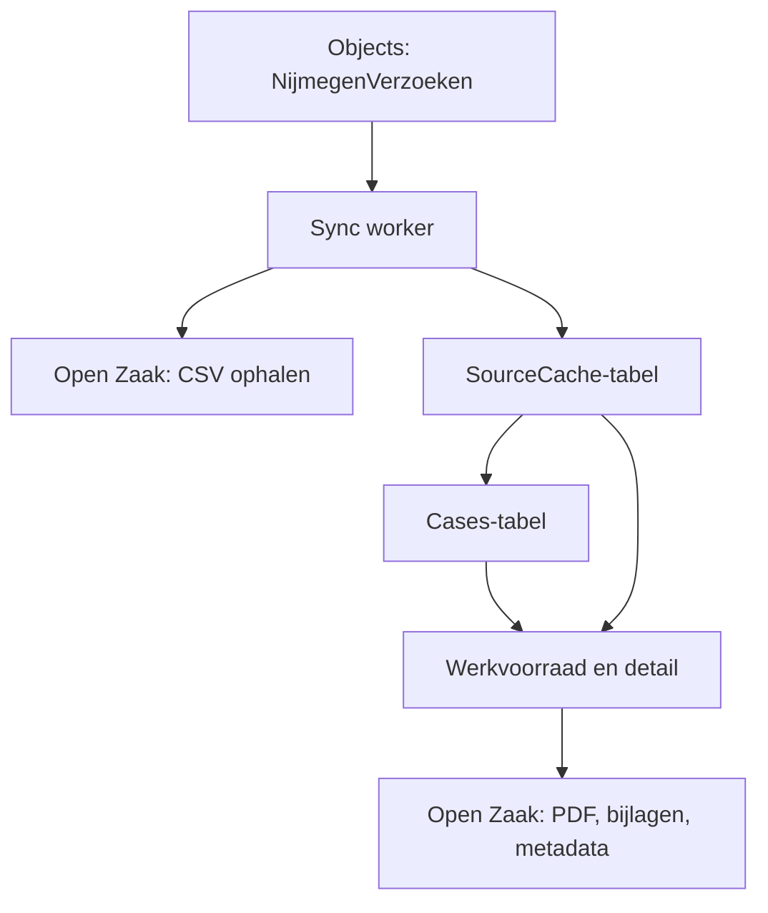

# Woonbehoefte

Tijdelijke verwerkingsomgeving voor de aanvraagronde "Stroomaansluiting woningbouw" (Woonbehoefte). Geen
generiek zaaksysteem: precies genoeg om zo'n 400 aanvragen als werkvoorraad te behandelen, met claim,
beoordeling, status, interne updates en checks.

## Bronnen en data-ownership

- **Objects** (`NijmegenVerzoek`) is de bron voor de ingezonden aanvraagdata (CSV-export per inzending).
- **Open Zaak** blijft de enige bron voor documenten (PDF, bijlagen). De applicatie kopieert nooit een
  bestand naar eigen opslag; een download haalt de inhoud live bij Open Zaak op.
- De applicatie schrijft nooit terug naar Objects, Open Zaak of Open Forms.

Twee volledig gescheiden DynamoDB-tabellen, ook fysiek en via IAM:

Tabel | Inhoud | Removal policy | Wie schrijft
--- | --- | --- | ---
`open-forms-management-woonbehoefte-source-cache` | genormaliseerde CSV-data, refresh-status | `DESTROY` (reproduceerbaar) | sync worker (Get/BatchGet/Put/Update), page Lambda alleen lezen + refresh claimen
`open-forms-management-woonbehoefte-cases` | case, source-links, aantekeningen, activiteit | `RETAIN`, PITR aan | sync worker mag alleen conditioneel *aanmaken* (`PutItem`, nooit `UpdateItem`); page Lambda heeft de volledige menselijke-mutatietoegang

Een source-refresh kan daardoor nooit lopende menselijke verwerking overschrijven: de sync worker heeft
er via IAM domweg geen rechten toe.

## Refreshflow



Een refresh (`POST /woonbehoefte/refresh`) claimt conditioneel een `runId` en start de sync worker
asynchroon (`InvocationType: Event`). De medewerker ziet voortgang door de werkvoorraad-pagina zelf te
verversen; er is bewust geen live-pollende UI zoals bij Sport, dat hield de bouwtijd korter.

De worker haalt alleen objects op die nog niet als `READY` in de huidige cacheversie staan, parseert de
CSV, en initialiseert daarna voor **elke** actuele `READY`-submission (dus ook al gecachte) een case en
primaire source-link, conditioneel. Zo herstelt een eerder afgebroken run zichzelf bij de volgende
refresh, zonder ooit een bestaande case te overschrijven.

## Permissions

Resource `woonbehoefte`, acties `view` en `manage`, geen scopes. Zoals overal in deze applicatie:

- `woonbehoefte:view` - lezen, zoeken, filteren, documenten downloaden;
- `woonbehoefte:manage` - alles wat hierboven staat, plus verversen, claimen, status/beoordeling/aantekeningen/checks;
- `woonbehoefte:*` - resource-admin, kan via de bestaande Gebruikers-pagina Woonbehoefte-rechten van
  andere medewerkers beheren;
- `*:*` - blijft overal superadmin.

De generieke `PermissionEvaluator` kent geen actiehiërarchie: `manage` impliceert technisch geen `view`.
Een behandelaar krijgt daarom in de praktijk beide rechten.

## Structuur

```text
src/app/woonbehoefte/
├── domain/          case-/source-typen, Nederlandse labels, datum/periode-formattering
├── source/          CSV-parser, Objects-query, sync worker en de bijbehorende cache-store
├── cases/            de Cases-tabel-repository (ook de mutatielogica: claim, status, beoordeling, ...)
├── overview/        werkvoorraad: filter, viewmodel, handler, refresh-actie
├── detail/           casedetail: viewmodel en handler
├── documents/         live documentmetadata en de beveiligde downloadroute
├── actions/           claim/release/takeover en statuswissel (inclusief niet-ontvankelijk)
├── assessment/       beoordelingsformulier
├── notes/            interne aantekeningen (append-only)
├── checks/            check vragen/afronden
├── templates/         de twee Mustache-pagina's (overzicht, detail)
├── woonbehoefte.lambda.ts             route-dispatcher van de page Lambda
└── woonbehoefte-function.ts           door projen gegenereerde Lambda-wrapper

src/infrastructure/woonbehoefte/
├── WoonbehoefteFeature.ts             composition root: tabellen, Lambda's, IAM, routes
├── WoonbehoefteSourceCacheTable.ts
├── WoonbehoefteCasesTable.ts
└── WoonbehoefteDataSourceAccess.ts    eigen kopie van het Objects/Open Zaak-credentialpatroon
```

`AppStack.ts` kent alleen `WoonbehoefteFeature` en geeft de gedeelde platformresources door
(management-API, permissions/audit/sessions-tabellen, configuratie). De feature importeert nergens iets
uit `src/app/sport/**` of `src/infrastructure/sport/**`; waar hetzelfde patroon nuttig was (cache-worker,
refresh-state, documentdownload) is het overgenomen als eigen Woonbehoefte-code, niet als gedeelde
afhankelijkheid.

## Verwijderen

Als de aanvraagronde is afgerond, is de feature in principe met een paar deletes te verwijderen:

1. `src/AppStack.ts` - de `WoonbehoefteFeature`-invocation en de bijbehorende import verwijderen.
2. `src/Statics.ts` - de twee `woonbehoefte*TableName`-constanten verwijderen.
3. `src/shared/navigation/RegisteredFeatures.ts` - het `woonbehoefte`-item verwijderen.
4. `src/app/permissions/catalog/RegisteredPermissionResources.ts` - de `woonbehoefte`-resource verwijderen.
5. `src/shared/audit/AuditEvent.ts` - de `WOONBEHOEFTE_*`-eventtypes verwijderen (of laten staan als
   historische audit-records ze nog gebruiken; verwijderen breekt daar niets aan, oude records blijven
   gewoon staan met een type dat niet meer in de huidige enum voorkomt).
6. `src/preview/render-previews.ts` - de Woonbehoefte-imports, `pages`-entries en de
   `ROUTE_TO_PREVIEW_FILE`-regel verwijderen.
7. De `.woonbehoefte-*`-CSS-blokken onderaan `src/app/static-resources/static/styles/screen.css`
   verwijderen.
8. `src/app/woonbehoefte/`, `src/infrastructure/woonbehoefte/` en `src/preview/fixtures/woonbehoefte.ts`
   volledig verwijderen.
9. `npx projen build` draaien zodat de gegenereerde `assets/app/woonbehoefte/**` en Lambda-wrapper-code
   verdwijnen.
10. De **Cases-tabel** heeft `RemovalPolicy.RETAIN`: die verdwijnt niet automatisch bij een deploy na
    verwijdering van de CDK-constructs. Exporteer de inhoud (of besluit bewust dat bewaren niet nodig is)
    en verwijder de tabel daarna handmatig.

Stap 9 en 10 zijn destructief/vereisen een bewuste keuze en horen bij een losse, expliciete
opruimactie, niet bij een gewone code-PR.
