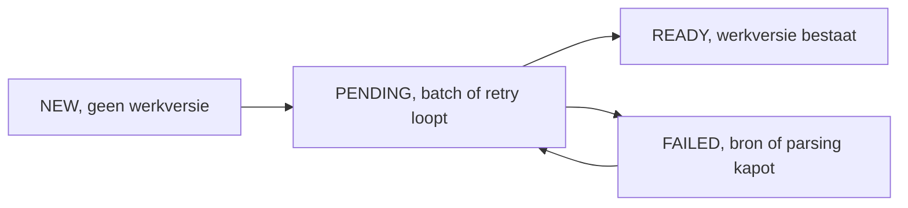
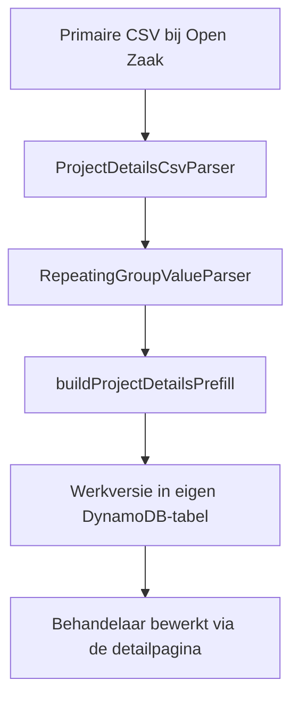

# Projectdetails (Mijn Aansluiting)

Subfeature van Woonbehoefte. Een aanvraag komt binnen als één platte CSV-inzending met drie herhalende
kolommen (woningen, voorzieningen, KOVA) in een eigen notatie, niet in JSON. Een behandelaar moet die data
straks handmatig overtypen bij MijnAansluiting.nl, het portaal van de netbeheerder. Projectdetails zet die
CSV om in een bewerkbare werklijst per dossier, zodat overtypen sneller en met minder fouten gaat.

Geen koppeling met MijnAansluiting.nl zelf, geen terugschrijven naar Objects, Open Zaak of Open Forms.
Puur een eigen tussenlaag, los van de rest van Woonbehoefte.

## Levenscyclus van een dossier

Zodra een werkversie bestaat is een dossier altijd READY, ook als de laatste poging ooit FAILED was.
Initialiseren is aanvullend: een bestaande werkversie is voor de initializer een gegeven, geen staat om op
te herstellen.

## Van CSV naar werklijst

De drie herhalende kolommen (wonen, voorzieningen, KOVA) staan niet in JSON maar in een eigen notatie: tekst
tussen aanhalingstekens, en None/True/False in plaats van null/true/false. RepeatingGroupValueParser leest
die notatie (source/parser/RepeatingGroupValueParser.ts, met TextScanner ernaast als leespositie-helper).
buildProjectDetailsPrefill zet de uitkomst om naar werkregels per categorie, met een parser per kolom
(parseHousingColumn.ts, parseFacilityColumn.ts, parseKovaColumn.ts) en twee gedeelde stukken:
groupIdenticalRows.ts (twee volledig identieke bronregels worden één werkregel met een aantal) en
buildOtherDetails.ts (elk bronveld dat geen eigen plek heeft wordt een gelabelde regel in een vrij tekstveld).

Initialiseren gebeurt met een knop op het overzicht (hele werkvoorraad, via een aparte worker-Lambda) of op
een enkel dossier (Nieuw of FAILED), altijd op expliciete actie van een behandelaar, los van de gewone
Woonbehoefte-sync. Blijft de bron structureel kapot, dan kan een behandelaar op de detailpagina ook een
lege werkversie starten en die zelf verder invullen, in plaats van op een nieuwe CSV-poging te wachten.

## Werkversie

Eén item per dossier, met per categorie een Map van regels (housingLines, collectiveFacilityLines,
kovaLines), geen array: een wijziging aan één regel is dan een gerichte Map-mutatie, zonder het
arrayindex-risico bij verwijderen. Verder: leesbare projectnaam, projectomschrijving, aanvullende
informatie voor Mijn Aansluiting, en projectbrede notities (zonnepanelen/laadpalen die voor het hele
project gelden, niet per woning).

Elke wijziging schrijft in dezelfde transactie ook een immutable history-regel weg (wie, wanneer, welke
actie, welke regel). Geen versienummer, geen optimistic locking: de laatste schrijfactie wint per onderdeel.

## Mappen

- domain, het type ProjectDetailsWorkVersion en de statuslogica (NEW/PENDING/READY/FAILED).
- source, de CSV- en notatie-parsers, met de kolomparsers en gedeelde hulpfuncties in source/parser.
- persistence, ProjectDetailsStore: alle DynamoDB-lees- en schrijfacties, inclusief history.
- initialization, de batch/losse-poging-logica en de worker-Lambda.
- ui, viewmodel en actiehandlers voor de detailpagina (bekijken, bewerken, regel toevoegen/verwijderen).
- test, echte geanonimiseerde CSV-samples plus de tests die de volledige pijplijn erop uitproberen.

## Niet in scope

Geen live koppeling met MijnAansluiting.nl: dat blijft een los, extern portaal. Geen automatische
hersynchronisatie van een bestaande werkversie; een keer READY betekent dat de batch dat dossier daarna
met rust laat.
